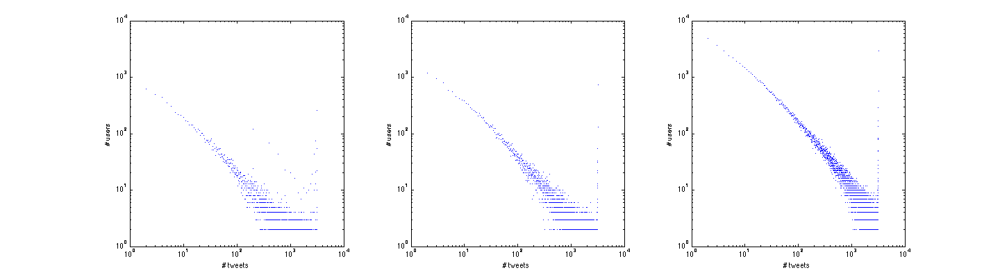
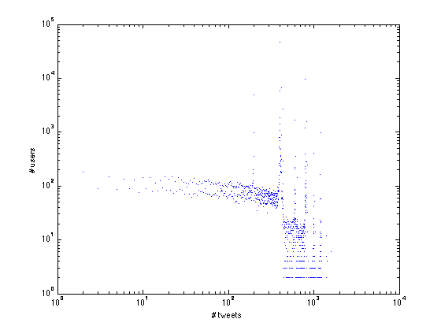

##Overview

The suspended user dataset is collected by Wenzhong Li et al, which contains about 120,000 users. There are 4 subsets of this dataset, [bishop](http://jlu.myweb.cs.uwindsor.ca/suspended/Tweets/bishop.txt.gz), [gambit](http://jlu.myweb.cs.uwindsor.ca/suspended/Tweets/gambit.txt.gz), [Havok](http://jlu.myweb.cs.uwindsor.ca/suspended/Tweets/Havok.txt.gz) and [Phoenix](http://jlu.myweb.cs.uwindsor.ca/suspended/Tweets/Phoenix.txt.gz).

Each subset is a large XML file that includes the collected tweets. The following lines are extracted from bishop.txt. This example shows the structure of this XML file. 

```
### 20100307T000116 ### 14939713]
<feed xml:lang="en-US" xmlns:georss="http://www.georss.org/georss" xmlns="http://www.w3.org/2005/Atom">
  <title>Twitter / TonyMullins</title>
  <id>tag:twitter.com,2007:Status</id>
  <link type="text/html" href="http://twitter.com/TonyMullins" rel="alternate"/>
  <link type="application/atom+xml" href="http://twitter.com/statuses/user_timeline.atom?user_id=14939713&amp;count=200&amp;page=1" rel="self"/>
  <updated>2010-03-07T08:01:09+00:00</updated>
  <subtitle>Twitter updates from TonyMullins / TonyMullins.</subtitle>
    <entry>
      <title>TonyMullins: Live Recording Session NOW! (Broadcasting live at http://ustre.am/Sw9)</title>
      <content type="html">TonyMullins: Live Recording Session NOW! (Broadcasting live at http://ustre.am/Sw9)</content>
      <id>tag:twitter.com,2007:http://twitter.com/TonyMullins/statuses/9994494808</id>
      <published>2010-03-04T22:42:47+00:00</published>
      <updated>2010-03-04T22:42:47+00:00</updated>
      <link type="text/html" href="http://twitter.com/TonyMullins/statuses/9994494808" rel="alternate"/>
      <link type="image/pjpeg" href="http://a1.twimg.com/profile_images/54792472/Tony_Summit_City-sepia_normal.jpg" rel="image"/>
      <author>
        <name>TonyMullins</name>
        <uri>http://www.btmediagroup.com</uri>
      </author>
    </entry>

    ...
```

Each collection of tweets starts with a line indicates the date and time of crawling and the id of user who posted these tweets. In XML, the entry element contains the main content of each tweet, together with the other information of this tweet, such as published date and author. We used the text in first child element (title) of entry as the text of this tweet. This is done by regular expression. 

First use regular expression to find the line contains the date and user id.
```Java
public static final Pattern TWEET_COLLECTION_START = Pattern.compile("###.+### (\\d+)]");
```
And then use regular expression to find the entry element which means the beginning part of tweet.
```Java
public static final Pattern TWEET_START = Pattern.compile("\\s*<entry>\\s*");
```
After we find the start of entry element, we put all the lines after that element into a buffer till we find the close of entry element.
```Java
public static final Pattern TWEET_END = Pattern.compile("\\s*</entry>\\s*");
```
And we extract the content from buffer, which is defined as the text of the first child element of entry.
```Java
public static final Pattern CONTENT_MATCHER = Pattern.compile("\\s*<entry>\\s*<\\w+>(.+?)<.*>.+");
```

After extraction, the parsed tweet is:

```
TonyMullins: Live Recording Session NOW! (Broadcasting live at http://ustre.am/Sw9)
```

And each tweet starts with the username of the author which should be removed. So the final tweet is:

```
Live Recording Session NOW! (Broadcasting live at http://ustre.am/Sw9)
```

We parsed bishop.txt and extracted unique 30,359 users, in which there are 27,490 users whose tweets have been collected and 2,869 users who have not posted any tweets (or whose tweets have not been collected in this dataset). [bishop-tweets.tar.gz](static/data/bishop-tweets.tar.gz) is the compressed folder that contains all the extracted tweets. The tweets of a user are stored in a single file named by the user id. [bishop-ids.txt](static/data/bishop-ids.txt) contains all the users collected from bishop subset. The format of this file is:

```
USER_ID \t USER_NAME \t TWEET_COUNT
```

And if TWEET_COUNT is 0, then username will be empty. [bishop-users.txt](static/data/bishop-users.txt) contains all the users whose tweets have been collected. The format of this file is same as bishop-ids.txt. [bishop-empty.txt](static/data/bishop-empty.txt) contains all ids of users who have not posted any tweets. The following 5 files are collected from the original XML file (bishop.txt). Each file contains the related lines of the user in bishop-empty.txt.

* [37310042](static/data/37310042.txt)
* [44939041](static/data/44939041.txt)
* [45705949](static/data/45705949.txt)
* [48465567](static/data/48465567.txt)
* [56113727](static/data/56113727.txt)

Compared to [Dr Lu's result](http://jlu.myweb.cs.uwindsor.ca/suspended/), we found that 12,872 users are missing in [bishopFreqUsers.txt](http://jlu.myweb.cs.uwindsor.ca/suspended/bishopFreqUsers.txt). The following 5 files are collected from the original XML file (bishop.txt). Each file contains the related lines of a missing user.

* [emilymw8](static/data/emilymw8.txt)
* [glamorous_baby](static/data/glamorous_baby.txt)
* [lruiz10](static/data/lruiz10.txt)
* [overstockr1](static/data/overstockr1.txt)
* [Lyssuhhhh209](static/data/Lyssuhhhh209.txt)

We also compared the extraction results in both Dr Lu's result and our result. The following files are collected from Dr Lu's extraction result and our extraction result which contain the tweet from TonyMullins.

* [Dr Lu's Result](static/data/TonyMullins.txt)
* [Our Result](static/data/14939713.txt)

The numbers of tweets in both files are the same (519). Dr Lu's result contains 3 more lines that contains other information.
```
2   0   Twitter / TonyMullins
3   0   Twitter / TonyMullins
4   0   Twitter / TonyMullins
```

The following figures show the tweet distribution of 1) lu's result, 2) our result of bishop, 3) our result of all four subsets. [download eps file](static/data/tweet-dist.eps)



There is a vertical line on the right of each figure because of the limitation of crawling. Each crawling of tweets collection will get 200 tweets, and many users have 16 screen of tweets, which means if the number of tweets of a user is larger than 16 * 200, then in this dataset we will only get 3200 tweets from him. So we can see that the maximum of count of tweets is 3200. The count of tweets of each user can be downloaded here:

* [lu's result](static/data/lu-bishop-tweet-count.txt)
* [our result of bishop](static/data/bishop-tweet-count.txt)
* [our result of all 4 subsets](static/data/spammer-tweet-count.txt)

(Note: the number of users in lu's result is 14,616, which is smaller than the original lu's unique users list. This is because the user whose tweet set is empty have been removed.)

We also compared the results of suspended users' tweet distribution with the normal users'. The following figure shows the tweet distribution of normal users ([download eps file](static/data/non-spammer-tweet-dist.eps)). The count of tweets of each user in normal user dataset can be downloaded here: [Count of Tweets of Normal User](static/data/non-spammer-tweet-count.txt).

<div style="width:500px; margin: 0 auto">

</div>

The total number of tweets collected from bishop.txt is 10,576,815. Average number of tweets of each user is 385. [bishop-token-freq.tar.gz](static/data/bishop-token-freq.tar.gz) contains the frequency list of all the tokens from tweets files. The following is top 10 tokens in tweets:
```
i       4086918
the     2703627
to      2478648
a       2232051
you     1702212
and     1464853
it      1414519
my      1313907
is      1287337
quot    1159229
```

