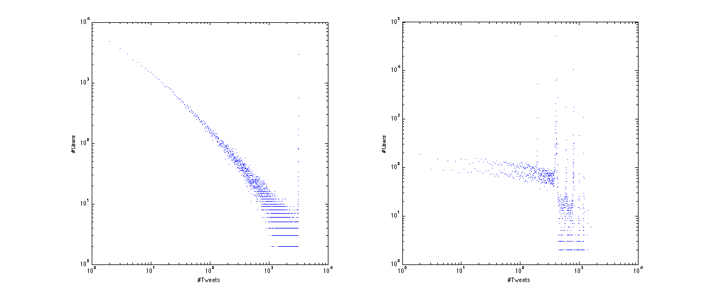
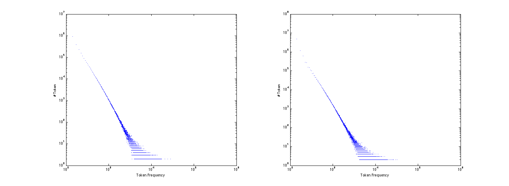
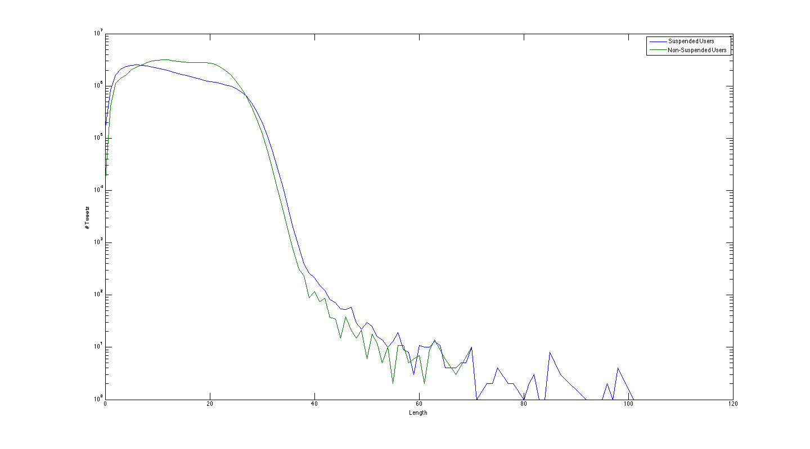
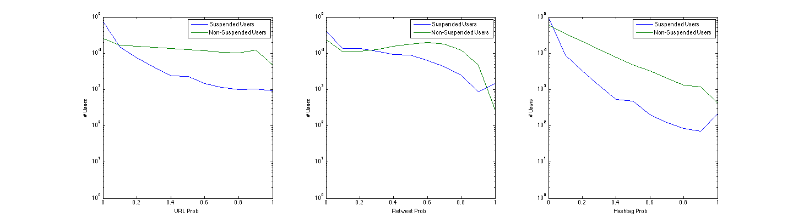

##Overview

### Suspended User Dataset

The suspended user dataset is collected by Wenzhong Li et al, which contains about 120,000 users. There are 4 subsets of this dataset, [bishop](http://jlu.myweb.cs.uwindsor.ca/suspended/Tweets/bishop.txt.gz), [gambit](http://jlu.myweb.cs.uwindsor.ca/suspended/Tweets/gambit.txt.gz), [Havok](http://jlu.myweb.cs.uwindsor.ca/suspended/Tweets/Havok.txt.gz) and [Phoenix](http://jlu.myweb.cs.uwindsor.ca/suspended/Tweets/Phoenix.txt.gz).

Each subset is a large XML file that includes the collected tweets. The following lines are extracted from bishop.txt. This example shows the structure of this XML file. 
<p class="well">
<strong style="color:blue">### 20100307T000116 ### 14939713] </strong><br>
...<br>
&nbsp;&nbsp;&nbsp;&nbsp;&lt;entry&gt;<br>
<strong style="color:red">&nbsp;&nbsp;&nbsp;&nbsp;&nbsp;&nbsp;&nbsp;&nbsp;&lt;title&gt;TonyMullins: Live Recording Session NOW! (Broadcasting live at http://ustre.am/Sw9) &lt;/title&gt; </strong><br>
&nbsp;&nbsp;&nbsp;&nbsp;&nbsp;&nbsp;&nbsp;&nbsp;...<br>
&nbsp;&nbsp;&nbsp;&nbsp;&lt;/entry&gt;<br>
&nbsp;&nbsp;&nbsp;&nbsp;...<br>
</p>

Each collection of tweets starts with <strong style="color:blue">a line</strong> indicates the date and time of crawling and the id of user who posted these tweets. In XML, the entry element contains the main content of each tweet, together with the other information of this tweet, such as published date and author. We used the text in <strong style="color:red">first child element of entry </strong>as the text of this tweet. This is done by regular expression. 

```Python
for each line in file:
  add line to a buffer
  if line matches '\s*</entry>\s*':
    use regular expression '\s*<entry>\s*<\w+>(.+?)<.*>.+' to extract content
```

Download extraction script here: [extract_sus_tweets.py](static/data/extract_sus_tweets.py). Use this script you can extract all the tweets from subset files like this:
```
./extract_sus_tweets.py bishop.txt
```
This will generate a file named bishop.txt.extracted which contains all the tweets from the original file. After extraction, the parsed tweet is:

```
TonyMullins: Live Recording Session NOW! (Broadcasting live at http://ustre.am/Sw9)
```

And each tweet starts with the username of the author which should be removed. So the final tweet is:

```
Live Recording Session NOW! (Broadcasting live at http://ustre.am/Sw9)
```

We parsed all the 4 subsets and extracted 45,411,890 tweets and unique 124,568 users, in which there are 113,347 users whose tweets have been collected and 11,221 users who have not posted any tweets (or whose tweets have not been collected in this dataset). [suspended-users.txt](static/data/suspended-users.txt) contains all the collected users. The format of this file is:

```
USER_ID \t USER_NAME \t TWEET_COUNT
```

And if TWEET_COUNT is 0, then username will be empty. [suspended-ids.txt](static/data/suspended-ids.txt) contains all the users whose tweets have been collected. [empty-suspended-ids.txt](static/data/empty-suspended-ids.txt) contains all ids of users who have not posted any tweets. Every line in these two files contains one user id.

### Non-Suspended User Dataset

The non-suspended user dataset is collected by Rui Li et al in 2012. There are 3 parts of this dataset, [Network](http://forward.cs.illinois.edu/datasets/UDI/UDI-TwitterCrawl-Aug2012-Profiles.zip), [Profile](http://forward.cs.illinois.edu/datasets/UDI/UDI-TwitterCrawl-Aug2012-Profiles.zip) and [Tweets](http://forward.cs.illinois.edu/datasets/UDI/UDI-TwitterCrawl-Aug2012-Tweets.zip). We here focused on the tweets collection.

There are 147,909 files in the tweets collection. Each file contains at most 500 tweets published by a user (In our experiments, we found that the number of tweets in each file is much larger than 500). Thus, in total, there are tweets from 147909 users. The filenames consistent with the user ID. For a file [ID1], it contains tweets about the user ID1. Tweets in a file are stored as the following format.

<p class="well">
\*\*\*<br>
Type: status<br>
<strong style="color:red">Origin: [ORIGINAL CONTENT]</strong><br>
Text: [PROCESSED CONTENT]<br>
URL: [URL TWEET]<br>
ID: [TWEET ID]<br>
Time:[CREATION TIME ]<br>
RetCount:[RETWEET COUNT]<br>
Favorite: [FAVORITE]<br>
MentionedEntities: [MENTIONED USER ID]<br>
Hashtags: [HASHTAG]<br>
\*\*\*<br>
\*\*\*<br>
...<br>
\*\*\*<br>
</p>

There are many fields that contain the information of this tweet, and we used <strong style="color:red">Origin Field</strong> to extract the content of this tweet. This is also done by regular expression

```
content = get file content and replace newline(\n) with space
find all tweets by 'Origin:(.*?)Text:' in content
```

[extract_nor_tweets.py] is used to extract all the tweets from non-suspended user. You can use this script like this:

```
./extract_nor_tweets.py UNZIPPED_TWEETS_DIR
```

This will generate a directory named non-suspended-tweets which contains all the tweets from the original directory. Each file named by the id of users and each line in this file contains one tweet.

We parsed this dataset and collected 147,909 users and 61,732,967 tweets. [non-suspended-ids.txt](static/data/non-suspended-ids.txt) contains all the ids of users. In this file, each line contains one id. There are 357 users that are in suspended user dataset so we need to remove them. [shared-user-ids.txt](static/data/shared-user-ids.txt)

### Analysis of datasets

We analyzed the tweets distribution and the token distribution of each dataset. The following figure shows the tweets distribution of 1) suspended users and 2) non-suspended users.



[Download eps file](static/data/tweet-count-dist.eps)

There is a vertical line on the right of suspended users because of the limitation of crawling. Each crawling of tweets collection will get 200 tweets, and many users have 16 screen of tweets, which means if the number of tweets of a user is larger than 16 * 200, then in this dataset we will only get 3200 tweets from him. So we can see that the maximum of count of tweets is 3200. 

Unlike the description on the website of non suspended dataset, we found that the number of tweets in each file is much larger than 500. In fact there are 26,746 users the number of whose tweets is more than 500. And the limitation number of crawling tweets is about 1,000. So we can figure out that there also are some vertical lines one the right indicating that there are many users the number of whose tweets i around 1,000. We provided an example user to prove that the number of tweets can be larger than 1,000, [Original Tweets File](static/data/100042133.original), [Extracted Tweets File](static/data/100042133).

The count of tweets of each user can be downloaded here:

* [suspended-tweets-count.txt](static/data/suspended-tweets-count.txt)
* [non-suspended-tweets-count.txt](static/data/non-suspended-tweets-count.txt)

We split the tweets into tokens by regular expression. The tokens can be:

* word or number 
* mention (@username)
* hashtag (#some_tag)
* url (http://t.co/abc)

The following figure is the token distribution of 1) suspended users and 2) non suspended users.



[Download eps file](static/data/token-count-dist.eps)

We can see there is no big difference between these two datasets and the figures are following power law as we expected. The following table shows top 10 words in both two datasets.

| Order | Suspended User Token | Suspended User Token Count | Non-Suspended User Token | Non-Suspended User Token Count |
|:-:|:-:|:-:|:-:|:-:|
|1|i|17885843|the|23201709|
|2|the|11862617|to|18428740|
|3|to|10779230|i|14673906|
|4|a|9606754|a|14438691|
|5|you|7339272|rt|11401000|
|6|and|6393430|you|10990669|
|7|it|6158153|for|10622819|
|8|my|5757008|in|9963998|
|9|is|5594945|and|9872263|
|10|in|4787718|of|9853931|

Download the word frequency list:

* [suspended-token-freq.tar.gz](static/data/suspended-token-freq.tar.gz)
* [non-suspended-token-freq.tar.gz](static/data/non-suspended-token-freq.tar.gz)

And we also analyzed the count of token in each tweets. The following figure shows the number of tokens in tweets.



[Download eps file](static/data/tweet-len-dist.eps)

There are some tweets in which the number of tokens is larger than 40, which is impossible because each tweet should be less than 140 characters. These tweets are in fact combined with some encoded special characters and when tokenizing each special character will be a single token. We can add the code of these special characters to the stop list to remove these characters.

URL, mention(retweet) and hashtag are 3 important properties of tweets. We computed the average URL containing probability, average retweet probability and average hashtag containing probability of each user and plotted in the following figure.



[Download eps file](static/data/tweet-prop-dist.eps)

The following table shows the statistic of both datasets.

|   | Suspended User | Non-Suspended User |
|:-:|:-:|:-:|
|# User | 113,347 | 147,909 |
|# Tweets| 45,411,890 | 61,732,967 |
|Average tweet Length | 12.34 | 14.10|
|Average # tweet per user | 400.64 | 417.37 |
|Average URL containing of all users| 13.89% | 43.52% |
|Average retweeting of all users | 46.08% | 48.22% |
|Average hashtag containing of all users | 8.08% | 20.70% |


### Sampling datasets
To train a classifier we need a balanced dataset, in which the numbers of suspended users and non-suspended users are same. And we also need the average number of tokens of both two datasets to be similar. The average number of tokens in suspended user dataset is 12.34 and the average number of tokens in non-suspended user dataset is 14.10. To balance this condition, we need to sample more tweets from suspended user dataset. 